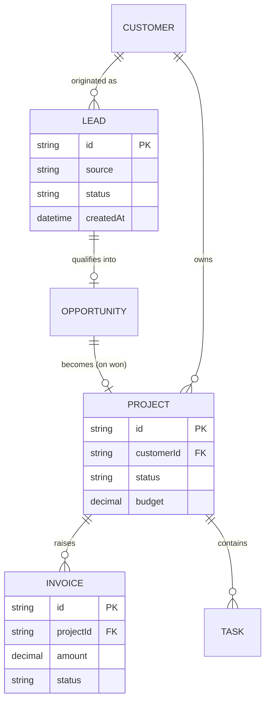

> ⚠️ **REFERENCE EXAMPLE — not project content.**
> Generic ERD for illustration only. Entities, attributes and relationships here have **not** been confirmed with Jewel Enterprises. Use as scaffolding when drawing the real ERD.

---

# Entity Relationship Diagram _(example)_

When real entities are confirmed, create `docs/data-models/entity-relationship.md` (without the `_templates/` prefix) and build the diagram from confirmed entities only.
