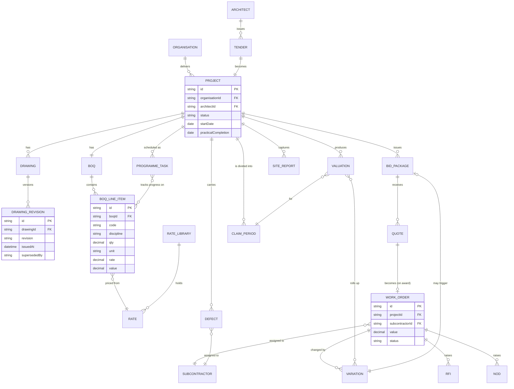
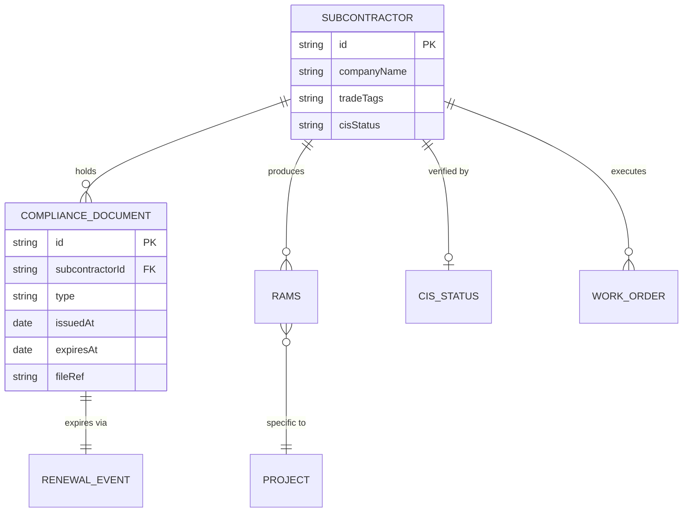
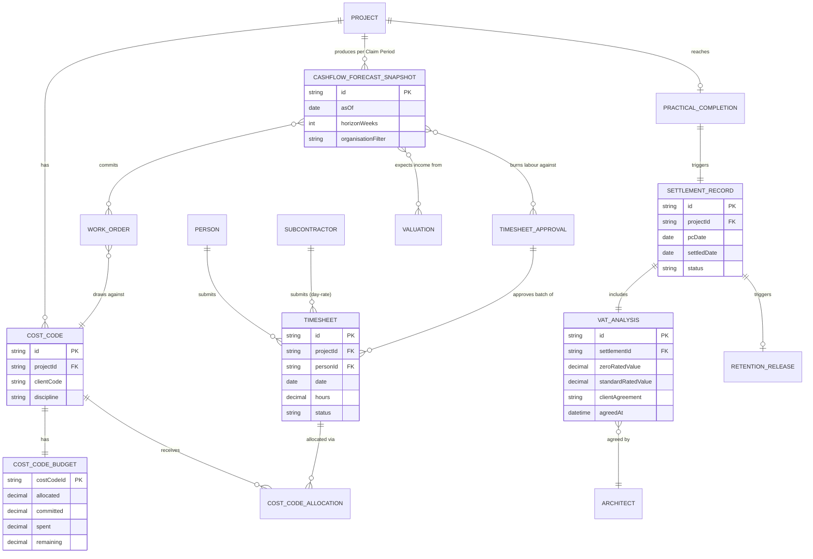

# Domain Concepts — Entity Relationship Diagram

First-cut ERD for JPMS. The shared language between the business and the system — every concept JPMS talks about (Project, Tender, Work Order, Variation, Claim Period, Cashflow Forecast, etc.) and how they relate. JSON Schemas are written workflow-by-workflow against these concepts.

**Status:** Draft — refined as each workflow moves Draft → In Review and each schema gets written.

---

## Diagram

The ERD is split into three sub-diagrams so each renders cleanly. They share entities (especially `Project`, `Subcontractor`, `Cost Code`) — the splits are for legibility, not data isolation.

### 1 · Project lifecycle (workflows 01–07)

### 2 · Subcontractor & compliance (workflow 08)

### 3 · Timesheets, cashflow forecast & project settlement (workflows 09, 10, 11)

---

## Entity index

Schemas remain `to be created`. Workflow column shows where each entity first appears.

### Project lifecycle

| Entity | First surfaced in | Notes |
|---|---|---|
| `Organisation` | All | The JBB / Jewel entity (BB, PS, PFP). Cross-entity flag on most other records. |
| `Project` | All | Central organising concept. |
| `Architect` | 01, 02 | External; issues tenders and approves variations / VAT outcome. |
| `Tender` | 02 | Becomes a project on award. |
| `Cost Code` | 02, 09 | Architect's reference; threads through project / WO / timesheet / valuation. |
| `Drawing` | 01, 02 | A drawing per scope. |
| `Drawing Revision` | 01 | Versioned with supersede logic. |
| `BoQ` | 02 | One per project (replaces standalone Excel). |
| `BoQ Line Item` | 02, 04, 05 | Discrete unit of priced and tracked work. |
| `Rate` | 02 | Held in the rate library. |
| `Rate Library` | 02 | Versioned, with supplier links. |
| `Bid Package` | 03 | Issued to subcontractors per trade. |
| `Quote` | 03 | Returned by subcontractors into JPMS. |
| `Work Order` | 03, 07, 09, 10 | The contract artefact; drives commitments on the cashflow forecast. |
| `Variation` | 04, 05 | Updates BoQ line items, rolls up to valuation; may trigger a bid package loop. |
| `RFI` | 04 | Question to architect; response attaches automatically. |
| `NoD` (Notice of Delay) | 04 | Formal delay notice. |
| `Programme Task` | 05 | Tied to BoQ line items. |
| `Valuation` | 05 | Per Claim Period; feeds expected income on the cashflow forecast. |
| `Claim Period` | 05, 10 | Contractual cycle for valuation reporting (typically monthly). |
| `Site Report` | 06 | Daily capture from site app. |
| `Defect` | 07 | Snag register per project. |
| `Practical Completion` | 07, 11 | PC event on a project; triggers workflow 07 defects and workflow 11 settlement in parallel. |

### Subcontractor & compliance

| Entity | First surfaced in | Notes |
|---|---|---|
| `Subcontractor` | 03, 08 | Master record with trade tags. |
| `Compliance Document` | 08 | Insurance, certs, tickets — with expiry. |
| `Renewal Event` | 08 | Compliance renewal cycle. |
| `RAMS` | 08 | Project-specific risk & method statement. |
| `CIS Status` | 08 | Verified against HMRC; gates eventual payment downstream. |

### Timesheets, cashflow forecast & settlement

| Entity | First surfaced in | Notes |
|---|---|---|
| `Person` | 09 | Internal staff (site team and project leads) who submit timesheets. |
| `Cost Code Budget` | 09 | Per-cost-code budget (allocated / committed / spent / remaining). Arbiter of the workflow 09 hard-block rule. |
| `Cost Code Allocation` | 09 | Each timesheet entry's allocation against a cost code. |
| `Timesheet` | 09 | Daily entry per person × project × date. |
| `Timesheet Approval` | 09 | Weekly batch approval record. |
| `Cashflow Forecast Snapshot` | 10 | A JPMS-produced forecast at a point in time. Built from project data alone. |
| `Settlement Record` | 11 | Final audit-grade summary at project close. Triggers retention release. |
| `VAT Analysis` | 11 | Zero-rated vs standard-rated breakdown; carries client agreement. |
| `Retention Release` | 11 | Trigger published for accountancy to action in AP. |

---

## Open questions on the model

- [ ] Multi-entity (BB / PS / PFP) modelling — separate `Organisation` records with cross-charge flag, or a single tenant with entity tag?
- [ ] Cost Code — independent entity per project, or attribute on `BoQ Line Item`?
- [ ] External party model — is `Architect` a special case of a generic `Contact`, or its own entity?
- [ ] Cashflow forecast persistence — snapshot per Claim Period, or always derived live?

---

## Process for refining

1. When a workflow moves Draft → In Review, write the JSON Schemas for the entities it touches in `/docs/data-models/{entity}.schema.json`.
2. Update the ERD here as relationships are confirmed.
3. Update root [`README.md`](../../README.md) Section 7 entities table to point at the new schema.
