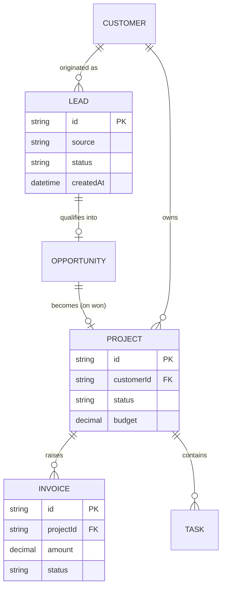

# Entity Relationship Diagram

Add entities and relationships to the diagram below as they are confirmed during scoping.

> This is a **starting sketch** — refine as entities are confirmed. Treat each relationship as a question for the next role-play session.
